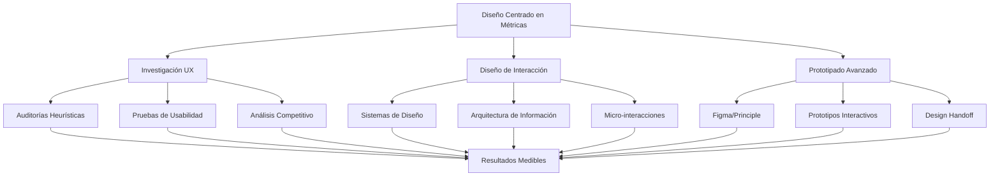

David Díaz | Portfolio de Producto y UX

🌟 Visión General

Portfolio profesional de David Díaz, Product UX Designer especializado en transformar experiencias digitales para impulsar métricas de negocio. Este sitio demuestra cómo el diseño estratégico centrado en el usuario genera un impacto medible: +340% en conversión promedio, +$2.1M en ingresos generados y resultados en 8 semanas.

Enlace directo: https://dsd228.github.io/NeoProdUx-Product-UX-Portfolio/

---

🎯 Propuesta de Valor Única

Filosofía de Diseño

"UX/UI enfocado en resultados reales, no en humo visual"

Diferenciales competitivos:

· ROI Comprobado: Cada proyecto incluye métricas verificables de impacto empresarial
· Modelo de Riesgo Cero: Primera semana de análisis sin compromiso financiero
· Velocidad de Ejecución: Resultados tangibles en ≤8 semanas
· Enfoque 100% Métrico: Decisiones basadas en datos, no en suposiciones

Métricas Clave de Rendimiento

```
• Conversión promedio: +340%
• Ingresos generados: $2.1M+
• Tiempo para resultados: 8 semanas
• Tasa de respuesta: <12 horas
• Proyectos exitosos: 50+
```

---

📊 Casos de Estudio Destacados

1. PASEO App - Plataforma FinTech para paseadores de perros

Duración: 8 semanas
Problema: Onboarding complejo con alta tasa de abandono inicial
Solución Estratégica:

· Rediseño del flujo de incorporación a 3 pasos simplificados
· Implementación de progreso visual y micro-interacciones
· Validación mediante pruebas de usabilidad iterativas

Resultados Cuantificables:

```
✓ Retención de usuarios: +78%
✓ Velocidad de onboarding: 3.2x más rápido
✓ Calificación de app: 4.9/5 estrellas
✓ Usuarios activos mensuales: +78%
```

2. Nexus Dashboard - SaaS B2B para logística

Duración: 12 semanas
Problema: Datos críticos inaccesibles afectando la toma de decisiones
Solución Estratégica:

· Reestructuración de la jerarquía visual de información
· Implementación de sistema de alertas proactivas
· Diseño de visualizaciones de datos personalizables

Resultados Cuantificables:

```
✓ Ingresos recurrentes mensuales (MRR): +$2.1M
✓ Tiempo de decisión: Reducción del 45%
✓ Satisfacción de usuarios: 92%
```

3. Tienda Premium - E-commerce mobile-first

Duración: 10 semanas
Problema: Checkout complejo con baja conversión en móvil
Solución Estratégica:

· Optimización del funnel de compra a 2 pasos
· Implementación de autocompletado inteligente
· Diseño de sistema de pagos con un solo clic

Resultados Cuantificables:

```
✓ Tasa de conversión: +62%
✓ Tráfico móvil optimizado: 94%
✓ Carritos abandonados: -41%
```

---

🔄 Metodología de Trabajo Probada

Fase 1: Análisis de Métricas (Semana 1)

· Auditoría UX/UI completa
· Análisis de funnel de conversión
· Revisión de heatmaps y sesiones grabadas
· Identificación de puntos críticos de fricción

Fase 2: Diseño Estratégico (Semanas 2-4)

· Creación de user flows optimizados
· Desarrollo de prototipos interactivos de alta fidelidad
· Configuración de pruebas A/B integradas
· Validación con usuarios reales

Fase 3: Implementación & Medición (Semanas 5-8)

· Desarrollo frontend colaborativo
· Seguimiento de KPIs en tiempo real
· Optimización continua basada en datos
· Documentación de resultados y ROI

Garantía NeoProdUx: "Primera semana sin compromiso - Si no ves valor, no pagas"

---

🛠️ Habilidades Técnicas y Enfoque

Competencias Principales



Filosofías de Trabajo

· Orientado a Resultados: Cada decisión de diseño alineada con KPIs de negocio
· Basado en Datos: Análisis de métricas y comportamiento real de usuarios
· Centrado en Usuarios: Empatía con necesidades reales, no con supuestos
· Iterativo y Ágil: Ciclos rápidos de prueba-aprendizaje-mejora

---

📈 Impacto Empresarial Demostrado

Transformación Digital Comprobada

Para Startups FinTech:

· Aumento de retención: +78%
· Reducción de tiempo de onboarding: 67%
· Incremento en valor de vida del cliente (LTV)

Para Empresas SaaS B2B:

· Generación de ingresos adicionales: $2.1M+
· Mejora en adopción de funcionalidades: +52%
· Reducción en costos de soporte: -34%

Para E-commerce:

· Incremento en tasa de conversión: +62%
· Optimización de experiencia móvil: 94% tráfico
· Reducción de carritos abandonados: -41%

---

🤝 Oferta de Consultoría Gratuita

Qué Incluye la Sesión de 30 Minutos:

1. Análisis Exprés de Métricas
   · Revisión de puntos críticos en tu funnel actual
   · Identificación de oportunidades inmediatas
2. 3 Estrategias Accionables
   · Ideas concretas para mejorar conversión
   · Recomendaciones aplicables en ≤2 semanas
3. Propuesta Personalizada
   · Roadmap de implementación específico
   · Presupuesto detallado y timeline realista
4. Garantía NeoProdUx
   · Primera semana sin compromiso financiero
   · Pago únicamente al ver resultados medibles

Compromiso de Respuesta: <12 horas desde la solicitud

---

🌐 Detalles Técnicos del Sitio

Stack Tecnológico

· Plataforma: GitHub Pages
· Diseño: Implementación responsive mobile-first
· Interactividad: Efectos 3D en exploraciones visuales
· Rendimiento: Optimizado para velocidad de carga
· Accesibilidad: Cumplimiento de estándares WCAG

Estructura del Contenido

1. Hero Section - Propuesta de valor principal
2. Exploraciones Visuales - Galería interactiva 3D
3. Métricas de Impacto - Resultados cuantificados
4. Casos de Estudio - Proyectos con contexto completo
5. Metodología - Proceso garantizado de 3 fases
6. Testimonios - Social proof verificable
7. Call-to-Action - Formulario de contacto optimizado

---

📞 Contacto y Colaboración

Proceso de Inicio Rápido

1. Consulta Inicial: Formulario web → Respuesta en <12h
2. Sesión Estratégica: 30 minutos de diagnóstico gratuito
3. Propuesta Personalizada: Entregada en 24 horas
4. Fase de Descubrimiento: 5 días sin compromiso

Disponibilidad y Compromisos

· Respuesta garantizada: <12 horas hábiles
· Consultas iniciales: Sin costo ni compromiso
· Modalidades: Remoto 100% o híbrido según necesidad
· Idiomas: Español nativo, Inglés profesional

---

🏆 Reconocimientos y Validación

Testimonios Verificables

"David no solo mejoró nuestro diseño, transformó nuestras métricas de negocio. +78% retención y reducción del 67% en tiempo de onboarding."
— Alex Chen, CEO de Startup FinTech

"El mejor ROI que hemos tenido en diseño. +$2.1M en ingresos adicionales en 12 semanas. Trabaja con métricas como nadie."
— James Wilson, CEO de SaaS Platform

Por qué Elegir NeoProdUx:

· ✅ Resultados Comprobados: +50 proyectos exitosos
· ✅ Transparencia Total: Métricas reales y verificables
· ✅ Velocidad de Entrega: Resultados en ≤8 semanas
· ✅ Modelo Sin Riesgo: Solo pagas por resultados
· ✅ Enfoque Integral: Desde investigación hasta implementación

---

Última actualización: Enero 2025
Estado del sitio: Activo y optimizado para conversión
Próximo paso: Agendar consulta gratuita

---

Este portfolio representa la filosofía de diseño de David Díaz: experiencias digitales que no solo se ven bien, sino que generan resultados medibles y transforman negocios.
